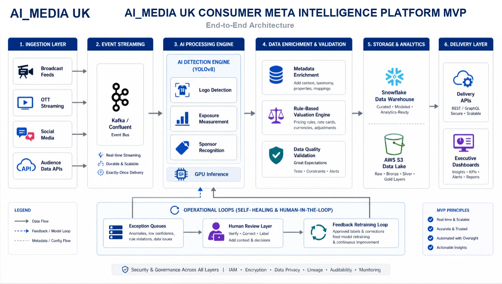
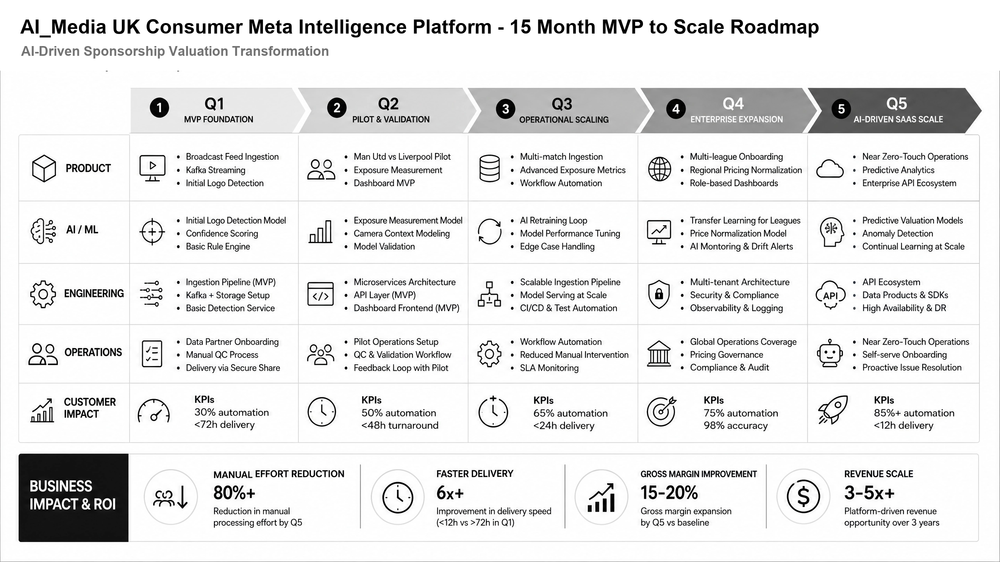

# B2C Consumer Meta Intelligence Research

AI_Media UK research concept for an AI-driven consumer, media, and sponsorship intelligence platform.

This repository is a public-safe product portfolio case study. It is based on personal research and interview assessment preparation, not client work, proprietary implementation, or confidential material.

## Executive Summary

AI_Media UK explores how a B2C media intelligence platform can convert broadcast, OTT, social, and audience signals into near-real-time sponsorship exposure intelligence. The platform combines event streaming, computer vision, metadata enrichment, rule-based validation, human-in-the-loop QA, and executive dashboards.

## Product Problem

Media and sponsorship teams often rely on delayed reporting, manual video review, spreadsheet-heavy valuation workflows, and fragmented audience data. This creates slow turnaround, inconsistent quality, limited auditability, and low confidence in campaign performance reporting.

## Product Vision

Build a scalable intelligence platform that delivers trusted media exposure insights with:

- Real-time ingestion from broadcast, OTT, social, and audience data sources
- AI-assisted logo, object, and sponsor/entity recognition
- Exposure measurement, metadata enrichment, and valuation support
- Human-in-the-loop review for low-confidence exceptions
- Data lineage, auditability, and governance across the workflow
- API and dashboard delivery for commercial and operational teams

## Featured Artifacts

- [Product assessment](docs/product-assessment.md)
- [Business architecture](docs/business-architecture.md)
- [15-month MVP roadmap](docs/mvp-roadmap.md)
- [Public sanitization notes](docs/sanitization-notes.md)
- [Sanitized UI wireframe](ui/wireframe.html)

## Visuals

### MVP Architecture

### MVP to Scale Roadmap

## Product Capabilities

- Media feed ingestion and normalization
- Event streaming and pipeline orchestration
- Computer vision inference for logo and sponsor detection
- Audience and pricing metadata enrichment
- Rule-based validation and data quality checks
- Exception queues and human review workflows
- Feedback loops for model improvement
- Secure API and dashboard delivery

## Target Outcomes

- Reduce manual processing effort by 80%+
- Improve delivery speed by 6x+
- Move from delayed reporting to sub-24-hour intelligence cycles
- Improve reporting trust with traceability and auditability
- Enable scalable SaaS-style delivery for media intelligence products

## Portfolio Positioning

This project demonstrates product management strength across AI platform strategy, B2C media analytics, cloud data architecture, workflow design, KPI thinking, MVP scope, and commercialization.
